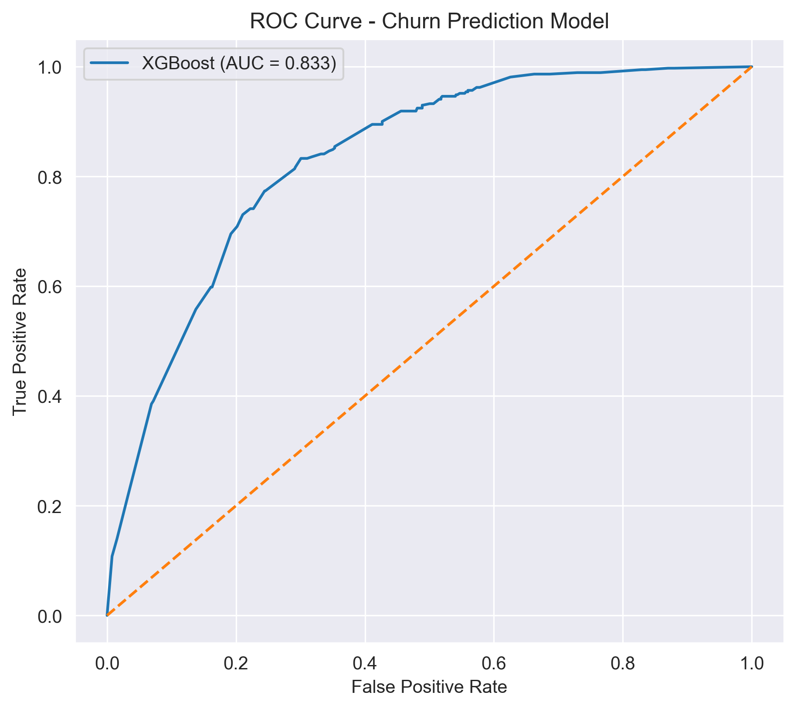
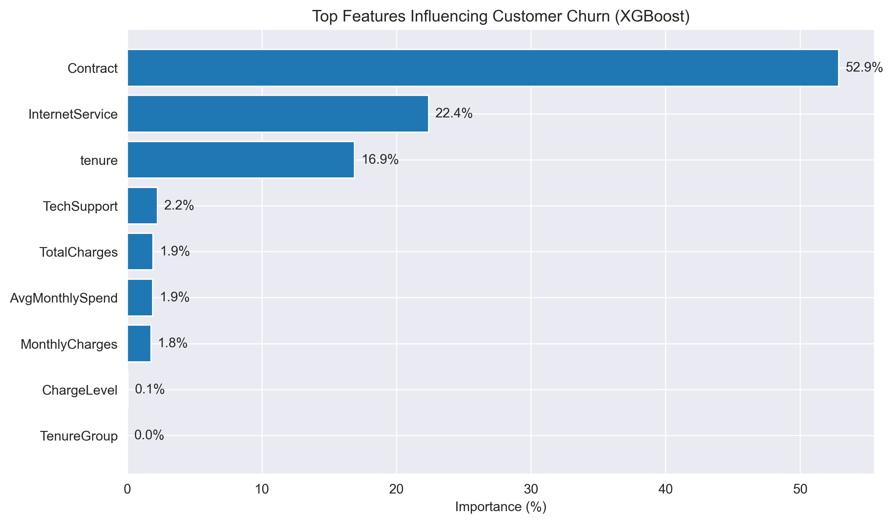
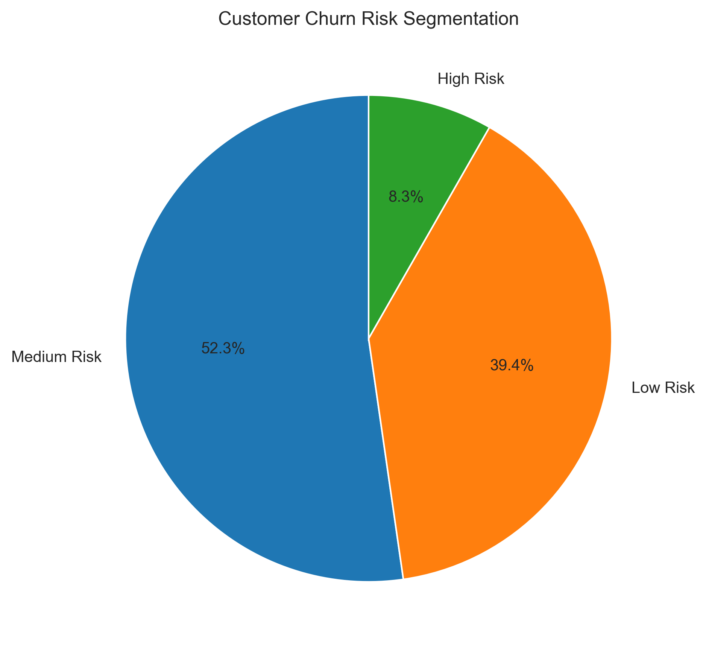
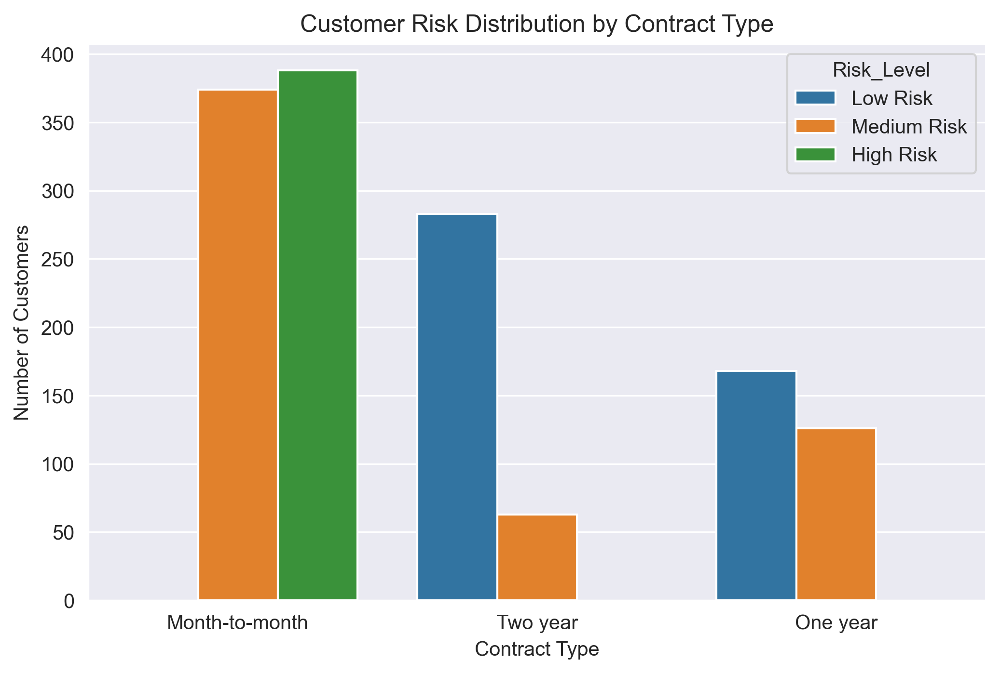
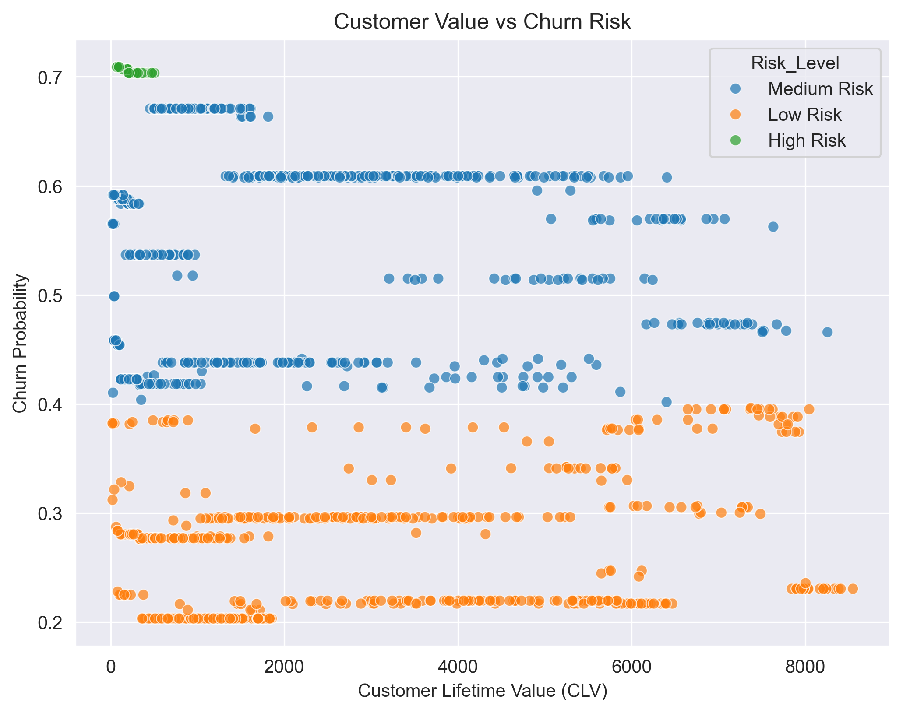

# Customer Churn Prediction and Risk Segmentation

## Overview

Customer churn is a major challenge for telecom companies because losing customers directly impacts revenue and long-term growth. Retaining existing customers is significantly more cost-effective than acquiring new ones, making churn prediction a critical business problem.

This project builds a **machine learning system to predict customer churn and segment customers based on churn risk** using the Telco Customer Churn dataset. By analyzing historical customer behavior and applying predictive modeling techniques, the system helps businesses identify customers who are likely to leave and implement targeted retention strategies.

The project includes:

- Exploratory Data Analysis (EDA)
- Statistical validation of churn drivers
- Feature engineering
- Machine learning pipelines
- Model comparison and tuning
- Threshold optimization
- Feature importance analysis
- Customer risk segmentation
- Customer lifetime value (CLV) based financial impact analysis
- Business recommendations

---

# Business Problem

Telecom companies frequently lose customers due to factors such as:

- Competitive pricing
- Service quality issues
- Lack of customer support
- Flexible month-to-month contracts

Key business questions:

- Which customers are likely to churn?
- What factors influence churn behavior?
- How can businesses prioritize retention efforts?

The goal of this project is to **predict churn probability and segment customers into risk groups**, enabling telecom companies to focus retention strategies on customers most likely to leave.

---

# Dataset

This project uses the **Telco Customer Churn dataset from Kaggle**.

Each row represents a telecom customer and includes:

- Customer demographics
- Contract type
- Internet service information
- Customer tenure
- Monthly charges
- Total charges
- Customer support information

### Target Variable
Churn
Yes → Customer left the company
No → Customer stayed

---

# Project Architecture
```bash
Raw Dataset
│
▼
Data Cleaning
│
▼
Exploratory Data Analysis
│
▼
Statistical Validation
│
▼
Feature Engineering
│
▼
Data Preprocessing Pipeline
│
▼
Model Training
(Logistic Regression | Random Forest | XGBoost)
│
▼
Hyperparameter Tuning
│
▼
Threshold Optimization
│
▼
Model Evaluation
│
▼
Feature Importance Analysis
│
▼
Customer Risk Segmentation
│
▼
Customer Value Analysis (CLV)
│
▼
Business Insights & Recommendations
```

---

# Exploratory Data Analysis

EDA was performed to identify patterns between customer characteristics and churn behavior.

### Key Observations

**Customer Tenure**

- Customers with **low tenure have significantly higher churn rates**
- Most churn occurs within the **first few months**
- Customers with **long tenure (>60 months) rarely churn**

Business insight: telecom companies should focus on **improving early customer experience**.

---

**Contract Type**

| Contract Type | Churn Risk |
|---------------|-----------|
| Month-to-month | Highest |
| One-year | Moderate |
| Two-year | Lowest |

Customers with **month-to-month contracts churn significantly more** than long-term customers.

---

**Monthly Charges**

Customers paying **higher monthly charges** tend to churn more frequently, indicating **pricing sensitivity**.

---

**Tech Support**

Customers without **technical support services** show higher churn rates, highlighting the importance of customer support in retention.

---

# Statistical Analysis

To confirm patterns observed during EDA, statistical tests were conducted.

### T-Test: Monthly Charges vs Churn

Result:

- p-value < 0.05
- Monthly charges have a **statistically significant relationship with churn**

---

### Chi-Square Test: Contract Type vs Churn

Result:

- p-value < 0.05
- Contract type significantly influences churn

Month-to-month customers churn significantly more.

---

### Chi-Square Test: Tech Support vs Churn

Result:

- p-value < 0.05
- Customers without technical support are significantly more likely to churn.

---

### Correlation Analysis

Correlation analysis showed:

- Strong positive correlation between **tenure and total charges**
- Moderate correlation between **monthly charges and total charges**
- Weak correlation between **tenure and monthly charges**

---

# Feature Engineering

Additional features were created to better capture customer behavior.

| Feature | Description |
|------|-------------|
| AvgMonthlySpend | Average monthly spending estimated from total charges |
| TenureGroup | Customer lifecycle stage based on tenure |
| ChargeLevel | Monthly charges grouped into Low, Medium, High |

Feature engineering was implemented using a **custom Scikit-Learn transformer integrated into the ML pipeline**.

Pipeline structure:
Feature Engineering → Preprocessing → Model

---

# Data Preprocessing

Different preprocessing techniques were applied to numerical and categorical features.

### Numerical Features

Standardized using **StandardScaler**

- tenure
- MonthlyCharges
- TotalCharges
- AvgMonthlySpend

---

### Categorical Features

Encoded using **OneHotEncoder**

- Contract
- InternetService
- TechSupport
- TenureGroup
- ChargeLevel

Settings used:

- `drop='first'` to avoid multicollinearity
- `handle_unknown='ignore'` for robust prediction

---

# Machine Learning Models

Three models were trained and compared:

- Logistic Regression
- Random Forest
- XGBoost

Because the dataset is imbalanced, techniques such as **class weighting and scale_pos_weight** were used.

---

# Hyperparameter Tuning

Hyperparameter tuning was performed for all models to improve performance.

The models were evaluated primarily based on **recall for churn customers**, since identifying potential churners is the primary business objective.

The **XGBoost model achieved the best performance**.

---

# Model Evaluation

Evaluation metrics used:

- Accuracy
- Precision
- Recall
- F1 Score
- ROC-AUC

The **XGBoost model achieved an ROC-AUC score of 0.83**, indicating strong predictive performance.

---

# ROC Curve



---

# Feature Importance

The XGBoost model was used to identify the most important predictors of churn.



Key churn drivers include:

- Contract type
- Internet service
- Customer tenure
- Tech support
- Monthly charges

---

# Customer Risk Segmentation

Customers were segmented based on predicted churn probability.

High Risk → Probability ≥ 0.70
Medium Risk → 0.40 ≤ Probability < 0.70
Low Risk → Probability < 0.40



---

# Risk Distribution by Contract Type



The visualization shows that **month-to-month customers dominate the high-risk segment**.

---

# Customer Lifetime Value (CLV) Analysis

To evaluate financial impact, customer lifetime value was estimated using:
CLV = MonthlyCharges × Tenure

The relationship between **customer value and churn risk** helps identify customers whose departure would result in the largest revenue loss.



Customers with **high CLV and high churn probability represent the most critical segment** and should be prioritized for retention efforts.

---

# Business Recommendations

### Encourage Long-Term Contracts

- Provide incentives for switching to 1-year or 2-year plans
- Offer contract upgrade discounts

Expected impact:

- Reduced churn
- More predictable revenue streams

---

### Improve Early Customer Retention

- Implement onboarding programs
- Offer incentives within the first 3-6 months
- Monitor new customers using churn risk scores

Expected impact:

- Reduced early churn
- Higher customer lifetime value

---

### Target High-Risk Customers

- Launch targeted retention campaigns
- Offer personalized discounts
- Provide proactive support outreach

Expected impact:

- Reduced churn among high-risk customers

---

### Deploy Continuous Churn Monitoring

The trained model can be used as a **decision-support tool** for ongoing churn monitoring by integrating predictions into CRM systems.

---

# Project Structure
```bash
customer-churn-prediction
│
├── data
│ └── Telco-Customer-Churn.csv
│
├── notebooks
│ └── churn_analysis.ipynb
│
├── src
│ ├── feature_engineering.py
│ ├── preprocessing.py
│ └── init.py
│
├── models
│ └── churn_model.pkl
│
├── figures
│ ├── feature_importance.png
│ ├── risk_segmentation.png
│ ├── roc_curve.png
│ ├── risk_contract_distribution.png
│ └── churn_value_risk_scatter.png
│
├── dashboard
├── api
│
├── requirements.txt
├── README.md
└── .gitignore
```

---

# How to Run the Project

1.Clone the repository (git clone https://github.com/tarun-rai21/churn-risk-intelligence.git)

2.Navigate to the project directory (cd customer-churn-prediction)

3.Install dependencies (pip install -r requirements.txt)

4.Open the notebook (jupyter notebook notebooks/churn_analysis.ipynb)

---

# Technologies Used

- Python
- Pandas
- NumPy
- Matplotlib
- Seaborn
- Scikit-learn
- XGBoost

---
## Future Improvements

Several enhancements can further improve this project and make it closer to a production-ready churn monitoring system:

- **Model Deployment**: Deploy the trained model using a REST API (e.g., FastAPI) to enable real-time churn predictions.
- **Interactive Dashboard**: Build a Streamlit dashboard to allow business users to explore churn risk and customer segments interactively.
- **Real-Time Churn Monitoring**: Integrate the model with customer relationship management (CRM) systems to continuously score customers and monitor churn risk.
- **Survival Analysis**: Estimate the expected time until churn to better understand customer lifecycle dynamics.
- **Additional Behavioral Features**: Incorporate customer usage patterns, engagement metrics, or service activity logs to improve predictive performance.

---

# Conclusion

This project demonstrates how machine learning can be used to **predict customer churn and support proactive retention strategies**.

By combining **data analysis, statistical validation, predictive modeling, and business insights**, the system enables telecom companies to identify customers at risk of leaving and take targeted actions to improve customer retention.
